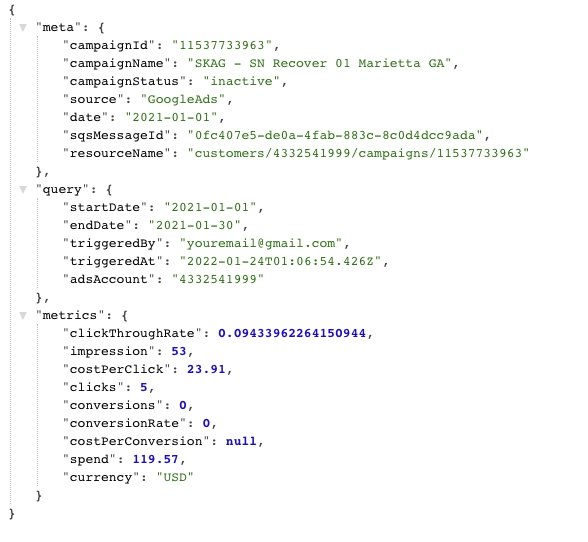
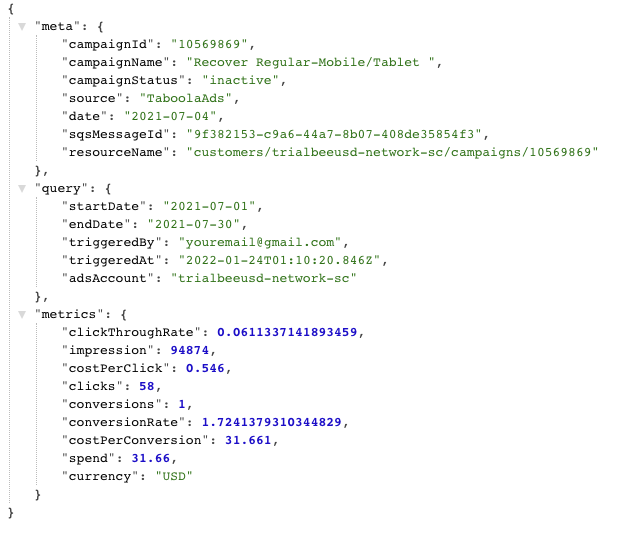
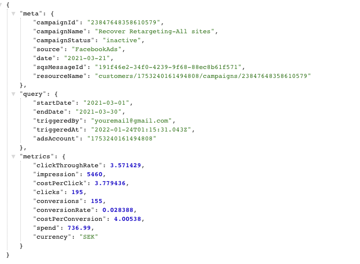

<div id="top"></div>

<!-- PROJECT LOGO -->
<br />
<div align="center">
  <a href="https://trialbee.com/">
    
  </a>

<h3 align="center">TrialBee Ads Data Pipeline</h3>
</div>


<!-- TABLE OF CONTENTS -->
<details>
  <summary>Table of Contents</summary>
  <ol>
    <li>
      <a href="#about-the-project">About The Project</a>
      <ul>
        <li><a href="#built-with">Built With</a></li>
      </ul>
    </li>
    <li>
      <a href="#getting-started">Getting Started</a>
      <ul>
        <li><a href="#prerequisites">Prerequisites</a></li>
        <li><a href="#installation">Installation</a></li>
      </ul>
    </li>
    <li><a href="#usage">Usage</a></li>
    <li><a href="#roadmap">Roadmap</a></li>
    <li><a href="#contributing">Contributing</a></li>
    <li><a href="#license">License</a></li>
    <li><a href="#contact">Contact</a></li>
    <li><a href="#acknowledgments">Acknowledgments</a></li>
  </ol>
</details>


<!-- ABOUT THE PROJECT -->
## About The Project

To build a backend ETL data pipeline to pipe data from multiple ads server (Google Ads, Taboola, Facebook ), tranform it to unified data format and then to store it in S3 bucket as daily campaign object.






<p align="right">(<a href="#top">back to top</a>)</p>


### Built With

* [Node.js](https://nodejs.org/en/)
* [Serverless](https://www.serverless.com/)
* [AWS S3](https://aws.amazon.com/s3/)
* [AWS Lambda](https://aws.amazon.com/lambda/)
* [AWS SQS](https://aws.amazon.com/sqs/)
* [AWS cloudwatch](https://aws.amazon.com/cloudwatch/)
* [AWS CLI](https://docs.aws.amazon.com/cli/latest/userguide/getting-started-install.html)
* [google-ads-api](https://www.npmjs.com/package/google-ads-api)


<p align="right">(<a href="#top">back to top</a>)</p>


<!-- GETTING STARTED -->
## Getting Started

Please follow the steps below to set up your project, run the code locally, invoke lambda function via SQS in cloud console.

### Prerequisites

* Ensure you are using `NPM version 7.18.1` and `Node.js version 14x (project using v16.4.1)` or above
  ```sh
  npm install npm@latest -g
  ```
* If you already have serverless install globally make sure you use the lasted `framwork '2' (project using Framework Core: 2.72.2 ` (Do not use framework '3'). You could skip this step if you prefer using local serverless (package.json, node module)
  ```sh
  npm install -g serverless@2
  ```
* Set up the AWS user account for your developer to use AWS service (only need programmatic access to use the aws command line)
  ```sh
  S3 permission
    AmazonS3FullAccess 
    or
    Allow: s3:ListBucket
    Allow: s3:PutObject
    Allow: s3:PutObjectAcl
    Allow: s3:GetObject
    Allow: s3:CreateBucket
    Allow: s3:ObjectCreated
  SQS permission
    Allow: sqs:SendMessage
    Allow: sqs:ReceiveMessage
    Allow: sqs:DeleteMessage
    Allow: sqs:GetQueueAttributes
    Allow: sqs:ListQueues
  CloudWatch Logs permission
    Allow: logs:CreateLogStream
    Allow: logs:CreateLogGroup
    Allow: logs:PutLogEvents
  Lambda permission
    AWSLambda_FullAccess
  AWS CloudFormation deployment
    AWSCloudFormationFullAccess
  ```
* Install AWS CLI and set up your AWS profile to access AWS from command line
  ```sh
  Install AWS CLI: https://docs.aws.amazon.com/cli/latest/userguide/getting-started-install.html

  Configure your AWS account: https://docs.aws.amazon.com/cli/latest/userguide/getting-started-quickstart.html
  $ aws configure
    AWS Access Key ID [None]: Your_Access_Key_ID
    AWS Secret Access Key [None]: Your_Secret_Access_Key
    Default region name [None]: Your_Default_region
    Default output format [None]: json
  ```
### Installation

1. Clone the repo
   ```sh
   git clone https://git-codecommit.us-west-2.amazonaws.com/v1/repos/trialbee-datapipeline-sls-repo-master
   or git clone your-git-repo-url (where the repo saved.)
   ```
3. Install NPM packages
   ```sh
   npm install
   ```
4. Update the credentials (AdsAccount, accessToken, clientId, clientSecret, developerToken, refreshToken) for each platform in the example folder. Please see each platform's ReadMe for the links and steps on how to obtain new credentials for each Ads platform.
   ```js
   
   `data-ga.json`
    {
    "startDate": "2021-01-01",
    "endDate": "2021-03-30",
    "adsAccount": "Your_Ads_Account",
    "source": "GoogleAds",
    "triggeredBy": "youremail@gmail.com",
    "clientId": "Your_Client_ID",
    "clientSecret": "Your_Client_Secret",
    "developerToken": "Your_Developer_Token",
    "refreshToken": "Your_Refresh_Token"
    }
    
    `data-fb.json`
    {
    "startDate": "2021-01-01",
    "endDate": "2021-01-30",
    "adsAccount": "Your_Ads_Account",
    "source": "FacebookAds",
    "triggeredBy": "youremail@gmail.com",
    "accessToken": "Your_Access_Token"
    }
    
    `data-tb.json`
    {
    "startDate": "2021-07-01",
    "endDate": "2021-09-30",
    "adsAccount": "Your_Ads_Account",
    "dimensionVal": "campaign_day_breakdown",
    "source": "TaboolaAds",
    "triggeredBy": "youremail@gmail.com",
    "clientIdObject": {
        "client_id": "Your_Client_Id",
        "client_secret": "Your_Client_Sercet",
        "grant_type": "client_credentials"
    }

   ```

<p align="right">(<a href="#top">back to top</a>)</p>


<!-- USAGE EXAMPLES -->
## Usage

Invoke Lambda Function locally & Upload Object to S3

<li>Google Ads: max time range = 90 days</li>
<li>Facebook Ads: max time range = 30 days</li>
<li>Taboola Ads: max time range = 90 days</li>
<p></p>

1. Invoke Lambda Function locally
   ```sh
   npm run local-ga
   
   npm run local-fb
   
   npm run local-tb
   ```
   
2. Invoke Lambda Function in AWS console via SQS
   ```sh
   a. Go to `Trialbee-AdPlatform-Queue-Master` and hit Send and receive messages
   ie: `Trialbee-GA-Queue-Master`

   b. Copy the json object from the `data-adPlatform.json` file into the Message body and hit `Send message`
   ie: `data-ga.json`
   ```
   
3. Automated Testing
   ```sh
   npm run test
   ```
   
4. Deploy AWS service with serverless deploy
   ```sh
   npm run deploy (currently default to prod)
   or 
   sls deploy --verbose -s Your_Stage_Name
   ```
   
5. Adding new Metrics to the Google Ads
   
   ```sh
   a. Add new metric to query object in googleAds-query.js file
   
   metrics: [
    'metrics.ctr',
    'metrics.impressions',
    'metrics.average_cpc',
    'metrics.clicks',
    'metrics.all_conversions',
    'metrics.clicks',
    'metrics.cost_per_conversion',
    'metrics.all_conversions_from_interactions_rate',
    'metrics.cost_micros',
    'segments.date',
    'metrics.**your_new_metric**'
   ]
   b. Add new metric mapping to update schemGA object in schema-ga.js file
   
    {
    name: 'campaignName',
    id: 'campaignId',
    status: 'campaignStatus',
    resource_name: 'resourceName',
    ctr: 'clickThroughRate',
    impressions: 'impression',
    average_cpc: 'costPerClick',
    clicks: 'clicks',
    all_conversions: 'conversions',
    all_conversions_from_interactions_rate: 'conversionRate',
    cost_per_conversion: 'costPerConversion',
    cost_micros: 'spend',
    date: 'date',
    **your_new_metric: 'yourNewMetric',**
    };
    
   c. Optional: Add new Metric to the createMetricsObj in the data-mapping-master.js file (Skip this step If you already add yourNewMetric)
   static createMetricsObj() {
    return {
      clickThroughRate: null,
      impression: null,
      costPerClick: null,
      clicks: null,
      conversions: null,
      conversionRate: null,
      costPerConversion: null,
      spend: null,
      currency: 'USD',
      **yourNewMetric: null,**
    };
  }
  ```
  
  6. Adding new Metrics to the Facebook Ads
   
   ```sh
   a. Add new metric to query object in facebookAds-query.js file
   
   fields: [
    'campaign_name',
    'campaign_id',
    'clicks',
    'cost_per_unique_click',
    'cpc',
    'ctr',
    'impressions',
    'spend',
    'actions',
    'account_currency',
    '**your_new_metric**'
   ]
   b. Add new metric mapping to update schemFB object in schema-fb.js file
   
    {
    campaign_name: 'campaignName',
    campaign_id: 'campaignId',
    resource_name: 'resourceName',
    ctr: 'clickThroughRate',
    impressions: 'impression',
    cpc: 'costPerClick',
    clicks: 'clicks',
    actionValue: 'conversions',
    conversionRate: 'conversionRate',
    cost_per_unique_click: 'costPerConversion',
    spend: 'spend',
    date_start: 'date',
    account_currency: 'currency',
    **your_new_metric: 'yourNewMetric',**
    };
    
   c. Optional: Add new Metric to the createMetricsObj in the data-mapping-master.js file (Skip this step If you already add yourNewMetric)
   static createMetricsObj() {
    return {
      clickThroughRate: null,
      impression: null,
      costPerClick: null,
      clicks: null,
      conversions: null,
      conversionRate: null,
      costPerConversion: null,
      spend: null,
      currency: 'USD',
      **yourNewMetric: null,**
    };
  }
  ```
  7. Adding new Metrics to the Taboola Ads
   
   ```sh
       https://backstage.taboola.com/backstage/api/1.0/${queryTB.account_id}/reports/campaign-summary/dimensions/${queryTB.dimension}?start_date=${queryTB.from_date}&end_date=${queryTB.to_date}&include_multi_conversions=true&exclude_empty_campaigns=true`
       
       Note: Taboola API already included all the standard metric when call the end point above. 
       Please refer to the document to configure additional metrics or dimension if needed.
       
      Please follow this link for more detail: https://developers.taboola.com/backstage-api/reference#campaign-summary-report
      Dimensions: https://developers.taboola.com/backstage-api/reference#dimensions-cheat-sheet
      Standard Metrics: https://developers.taboola.com/backstage-api/reference#campaign-summary-fixed-columns
   
   b. Add new metric mapping to update schemFB object in schema-fb.js file
   
    {
    campaign_name: 'campaignName',
    campaign_id: 'campaignId',
    resource_name: 'resourceName',
    ctr: 'clickThroughRate',
    impressions: 'impression',
    cpc: 'costPerClick',
    clicks: 'clicks',
    actionValue: 'conversions',
    conversionRate: 'conversionRate',
    cost_per_unique_click: 'costPerConversion',
    spend: 'spend',
    date_start: 'date',
    account_currency: 'currency',
    **your_new_metric: 'yourNewMetric',**
    };
    
   c. Optional: Add new Metric to the createMetricsObj in the data-mapping-master.js file (Skip this step If you already add yourNewMetric)
   static createMetricsObj() {
    return {
      clickThroughRate: null,
      impression: null,
      costPerClick: null,
      clicks: null,
      conversions: null,
      conversionRate: null,
      costPerConversion: null,
      spend: null,
      currency: 'USD',
      **yourNewMetric: null,**
    };
  }
  ```
   
## Remote - AWS Console
The AWS references below are for Google Ads, which can be used as a guide for the other ad networks.

### AWS S3
- Go to `AWS S3` in the AWS Console to see the objects: 

    ```
    bucket: datapipeline.trialbee.com.master
    ``` 
    [AWS Console link](https://s3.console.aws.amazon.com/s3/buckets/datapipeline.trialbee.com.master?region=us-west-2&tab=objects)

    ```
    bucketOne: datapipeline.trialbee.com.master.copy
    ``` 
    [AWS Console link](https://s3.console.aws.amazon.com/s3/buckets/datapipeline.trialbee.com.master.copy?region=us-west-2&tab=objects)

### AWS SQS
- Check `AWS SQS` queue in the AWS Console.

    ```
    Trialbee-GA-Queue-Master
    ``` 
    [AWS Console link](https://us-west-2.console.aws.amazon.com/sqs/v2/home?region=us-west-2#/queues/https%3A%2F%2Fsqs.us-west-2.amazonaws.com%2F802850677066%2FTrialbee-GA-Queue-Master)

### AWS Lambda
- Check `Lambda function` in the AWS Console.

    ```
    trialbee-datapipeline-sls-repo-master-prod-get-ga
    ```
    [AWS Console link](https://us-west-2.console.aws.amazon.com/lambda/home?region=us-west-2#/functions/trialbee-datapipeline-sls-repo-master-prod-get-ga)

### AWS CloudWatch  
- Check `AWS CloudWatch` alerts and metrics in the AWS Console
    - Alert sends email notification to notify the subscriber if there is anything wrong with the lambda function.
    - E.g AWS CloudWatch alarm alert with SNS (email notification): 
    
    ```
    trialbee-datapipeline-sls-repo-master-prod-GetDashtbFunctionErrorMetricFilterAlarm-9T5YUYZD1Q0P
    ``` 
    [AWS Console link](https://us-west-2.console.aws.amazon.com/cloudwatch/home?region=us-west-2#alarmsV2:alarm/trialbee-datapipeline-sls-repo-master-prod-GetDashtbFunctionErrorMetricFilterAlarm-9T5YUYZD1Q0P?~(alarmStateFilter~'ALARM))


### AWS SNS
- Check `AWS SNS` topics in the AWS Console.

    ```
    trialbee-datapipeline-sls-repo-master-prod-function-metric-error-filter-alarm
    ```
    [AWS Console link](https://us-west-2.console.aws.amazon.com/sns/v3/home?region=us-west-2#/topic/arn:aws:sns:us-west-2:802850677066:trialbee-datapipeline-sls-repo-master-prod-function-metric-error-filter-alarm)

    ```
    trialbee-datapipeline-sls-repo-master-prod-lambda-all-alarm 
    ``` 
    [AWS Console link](https://us-west-2.console.aws.amazon.com/sns/v3/home?region=us-west-2#/topic/arn:aws:sns:us-west-2:802850677066:trialbee-datapipeline-sls-repo-master-prod-function-metric-error-filter-alarm)


<p align="right">(<a href="#top">back to top</a>)</p>


<!-- ROADMAP -->
## Roadmap

- [ ] Hand over to TrialBee team
- [ ] Integrate with TrialBee dashboard
- [ ] Add Ad data level to the response object

<p align="right">(<a href="#top">back to top</a>)</p>


<!-- CONTRIBUTING -->
## Contributing

<p align="right">(<a href="#top">back to top</a>)</p>


<!-- LICENSE -->
## License


<p align="right">(<a href="#top">back to top</a>)</p>


<!-- CONTACT -->
## Contact


<p align="right">(<a href="#top">back to top</a>)</p>


<!-- ACKNOWLEDGMENTS -->
## Acknowledgments

<p align="right">(<a href="#top">back to top</a>)</p>
